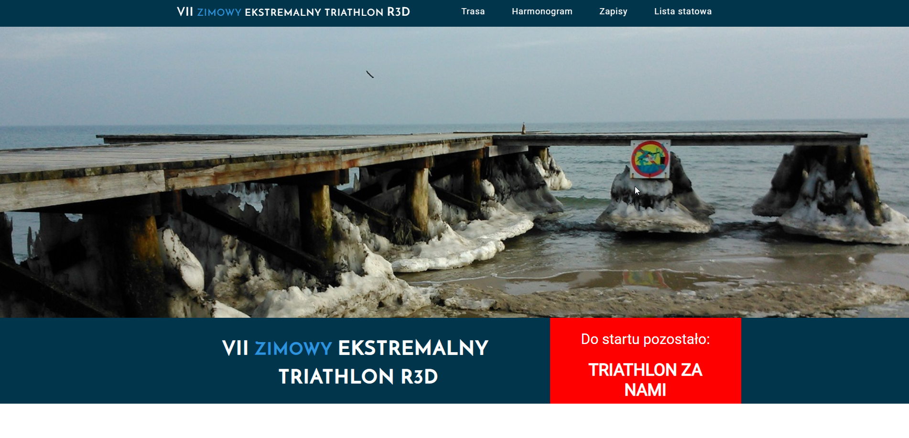

# Zimowy-Triathlon-R3D
My first project made for VII R3d Winter Triathlon.

## Table of contents
* [General info](#general-info)
* [Screenshots](#screenshots)
* [Technologies](#technologies)
* [Setup](#setup)
* [Features](#features)
* [Status](#status)
* [Inspiration](#inspiration)
* [Contact](#contact)

## General info
A simple website written for VII R3d Winter Triathlon. It includes a clock counting the time to start, competition schedule, map with marked locations, graphics with the course of the route and an application form. 

## Screenshots

## Technologies
* HTML5
* CSS
* JAVA SCRIPT
* Written in Visual Studio Code

## Setup
Link to demo version: https://egwizdala.github.io/Zimowy-Triathlon-R3D/

## Status
Project is: _finished_,

## Contact
Created by Emilia Gwizdala emilia.gwizdala@gmail.com - feel free to contact me!
